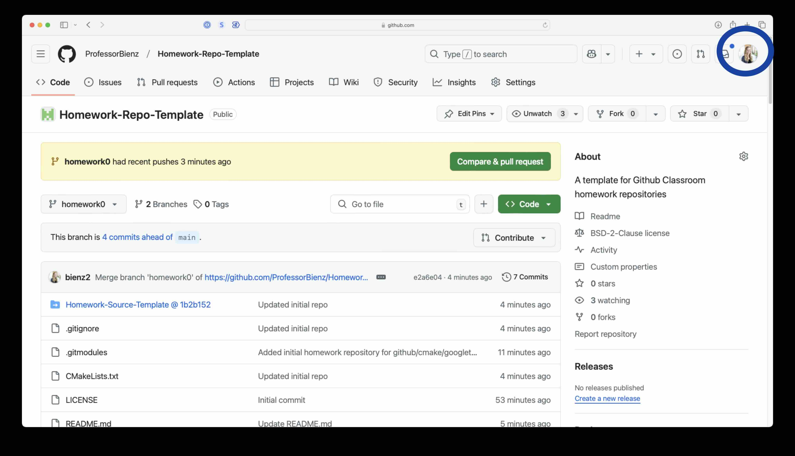
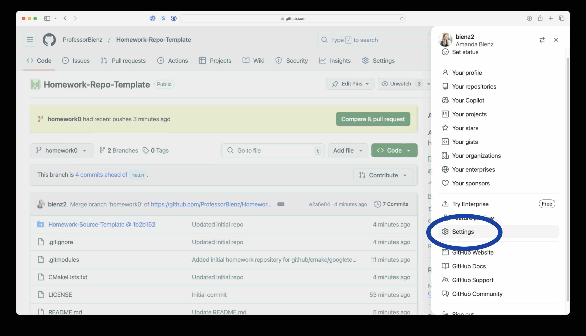
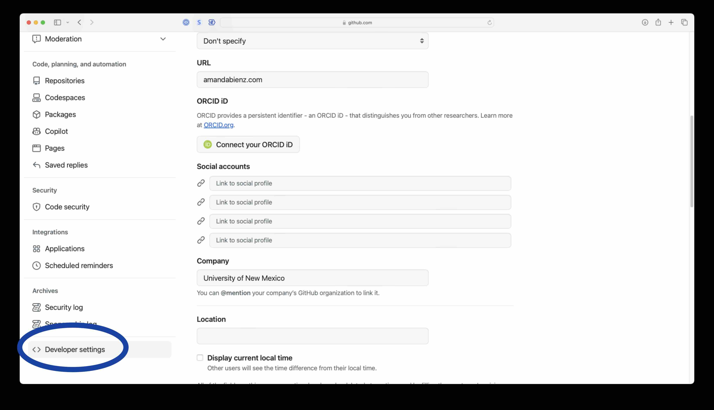
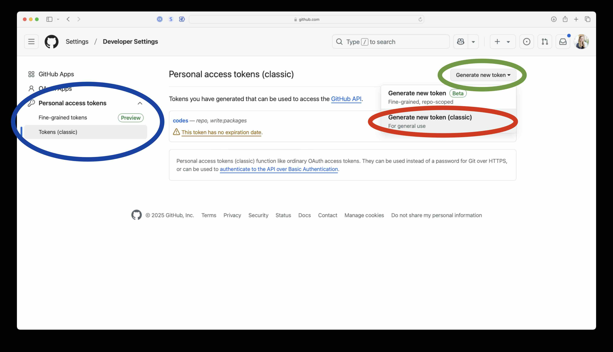
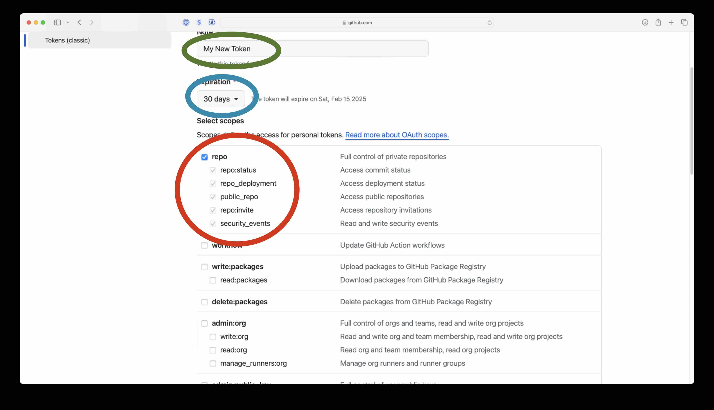
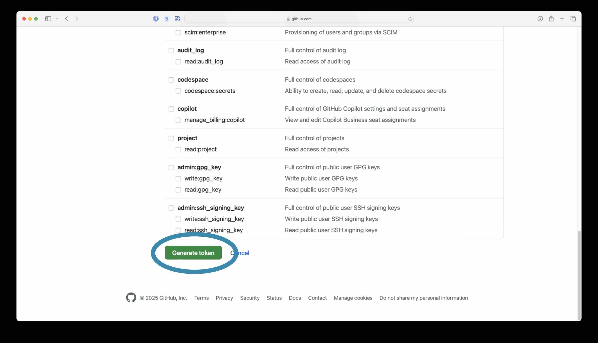
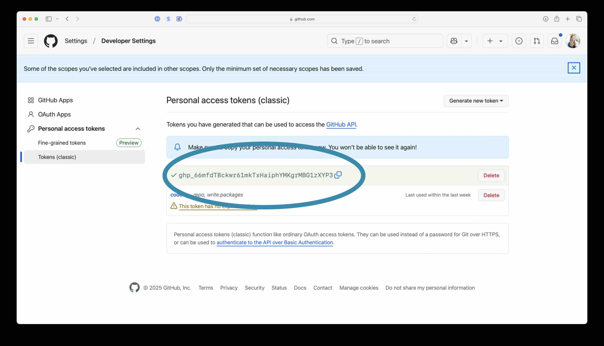

To create a Github authentification token:

First, got to `github.com` and click on your image in the top right corner.

Then, click on `Settings`

Scroll down and click on `Developer Settings`

Click on `Personal Access Tokens` and `Tokens` (highlighted in blue).  Then click `generate new token` (both the green and then red buttons).

This will allow you to create a new token.  Your token will be a generated password that will give you access to Github features.  To create a new token, give your token a name (green), select the amount of time your token should remain active (blue), and click the box next to `repo` (red).  The `repo` option lets you control code repositories.  This is needed to complete homework for our class.  **Make sure to select an expiration date past the end of the semester so that you don't need to redo these steps to complete assignments for this course.**

Click generate to create this token.

This will create a token for you.  It is a password, similar to the example below.  It will not allow you to login to `github.com`.  It will allow to `pull`, `push`, and otherwise manipulate homework repositories.

To return to the steps of this homework [click here](README.md).
