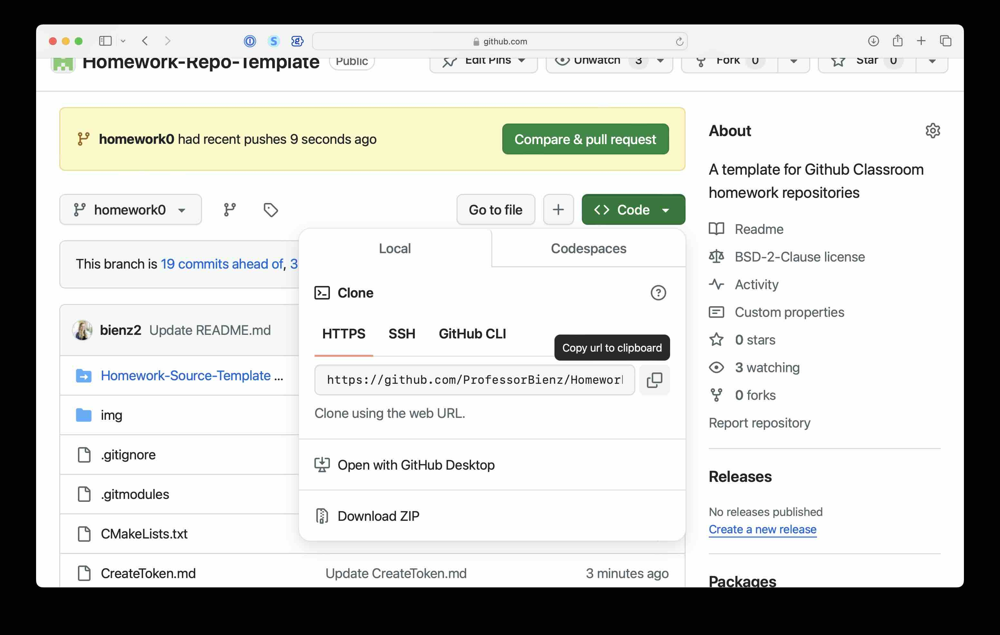
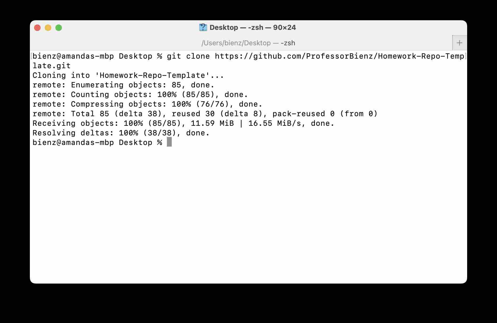
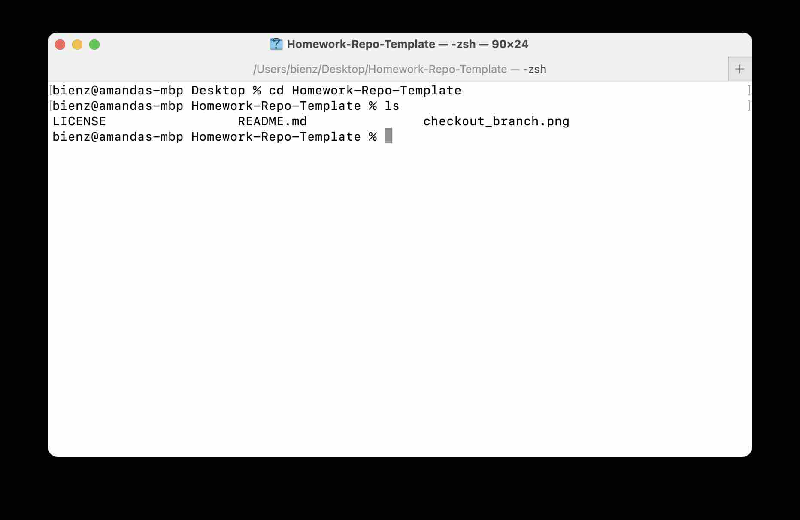
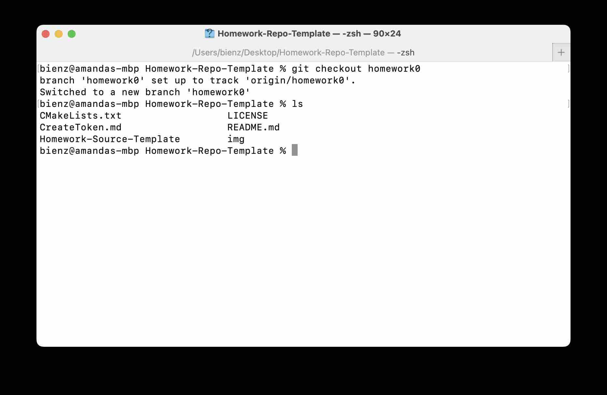
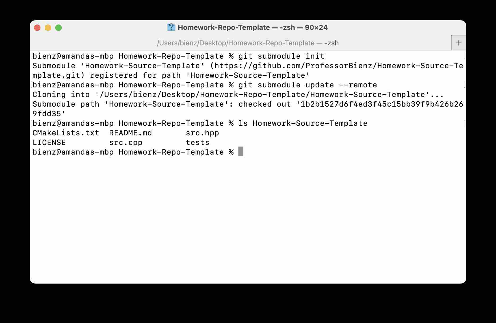
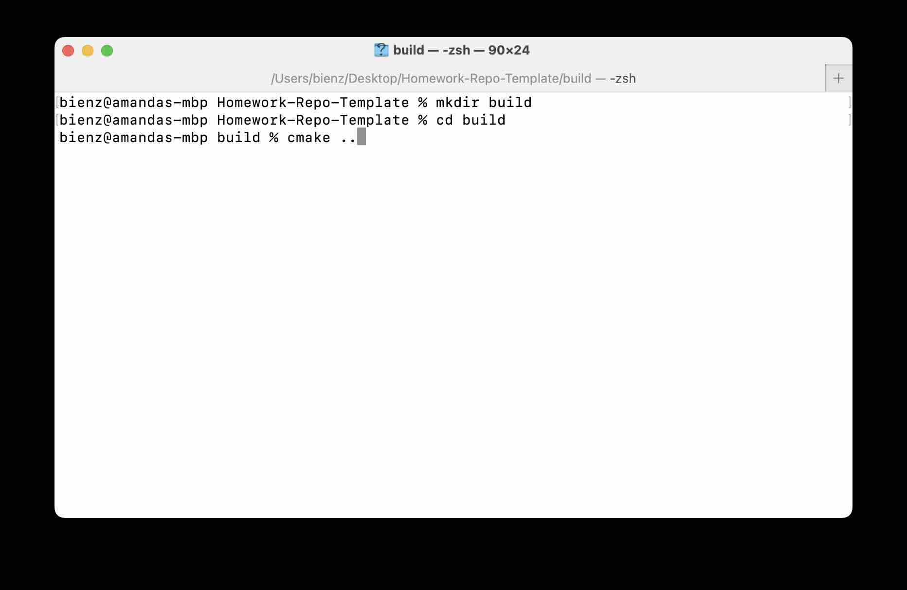
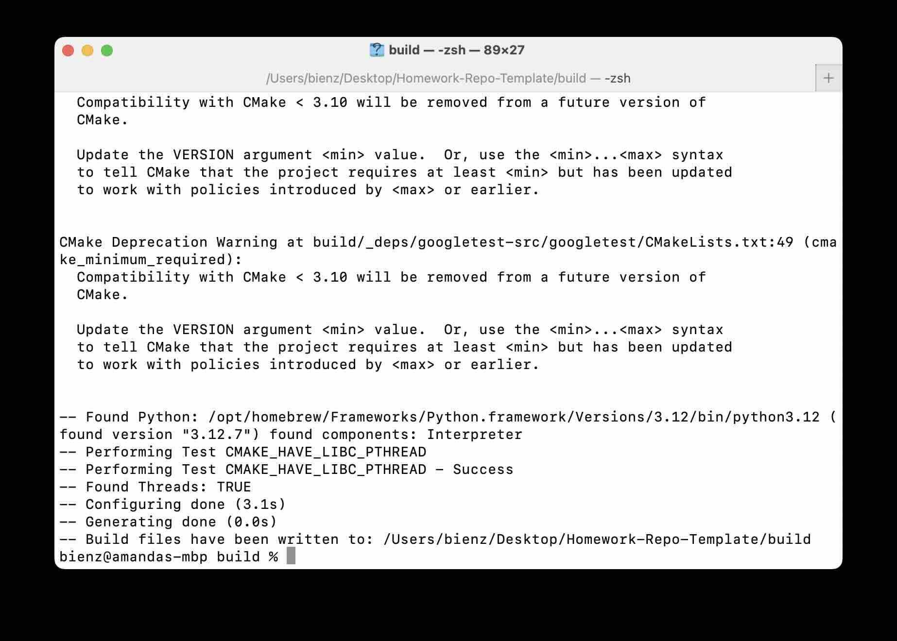
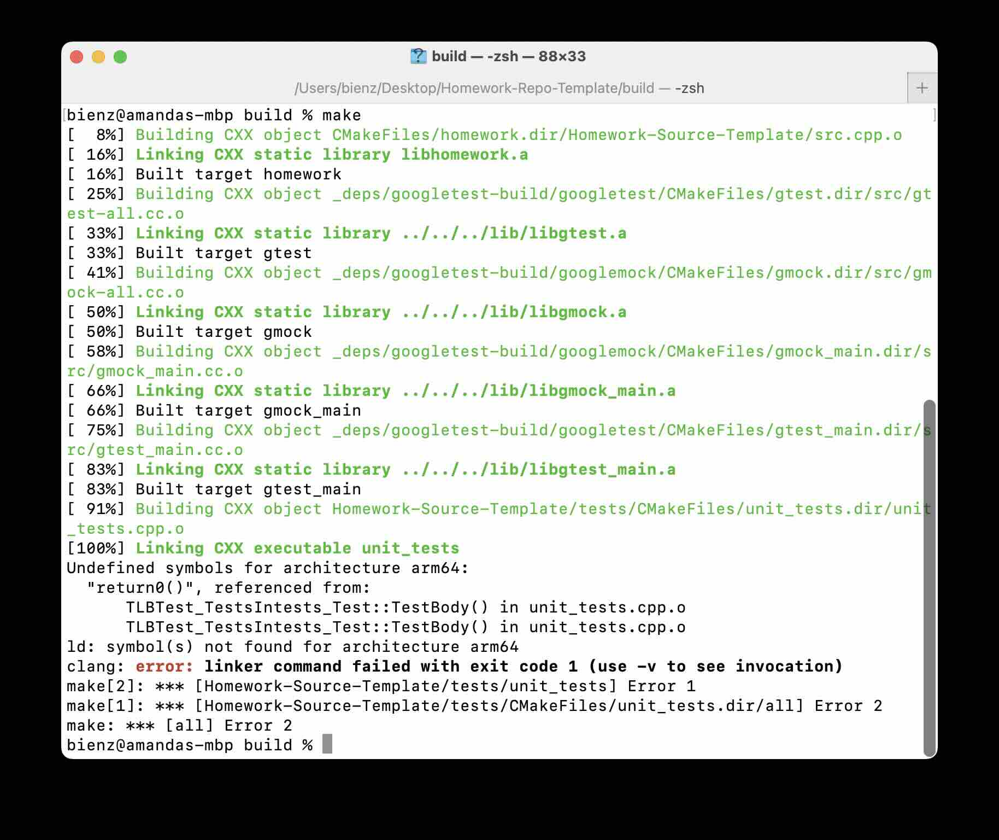
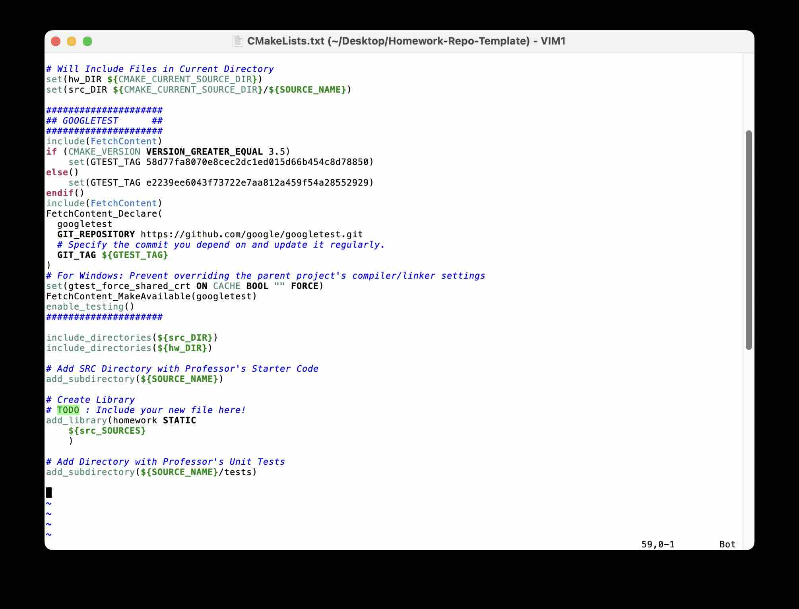
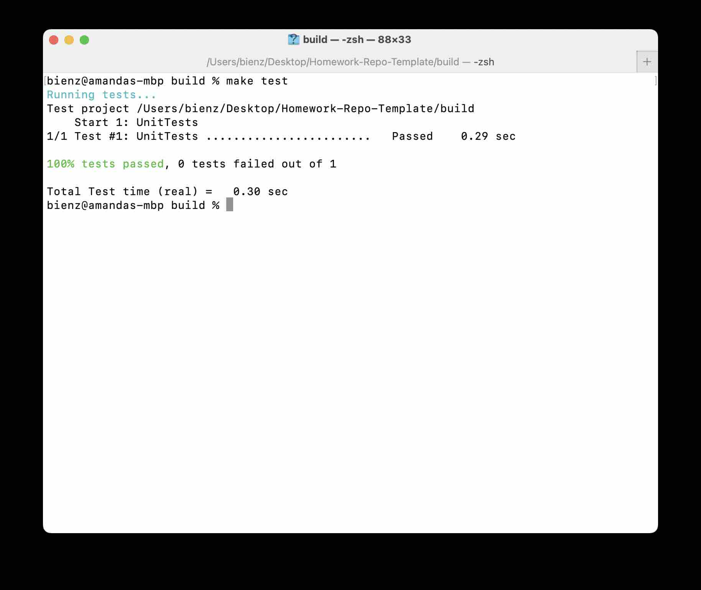

# Homework 0 : GitHub, CMake, and Googletest

## Part 1 : Checking out a GitHub Classroom Repository
GitHub Classroom will be used for all homework assignments.  You will be given an initial repository.  Instructions for the assignment will be provided in the README.md.  Follow the steps below to complete the initial GitHub portion of Homework 0.

### 1.a) Clone the repository to a local machine
You can clone the repository with 'git clone \<repository\_name\>.  The repository name can be found by clicking the green 'Code' button.  Click on the HTTPS tab if you use Github token authentification, and the SSH tab if you have setup an SSH key.  For more information on authentification methods, click here: [Instructions for Creating Tokens](CreateToken.md)

The image below shows how to copy the repository name when using token authentification.

The image below shows me cloning my repository.  If asked for a password, you will need to use your Github token ([reminder: token instructions](CreateToken.md)).

### 1.b) Checkout the homework0 branch
The initial repository for this homework is in the branch called 'homework0'.  You can get access to this code with the command 'git checkout homework0'

The image below shows what the folder looks like after I clone the repository. **The main branch is always cloned.**

After switching to the `homework0` branch, my folder is filled with the files needed to complete this homework.

### 1.c) Pull submodule changes
All homework repositories will contain a folder called 'Homework-Source-Template'.  This folder is called a submodule, because it points to a separate Github repository that you are unable to edit.  Changes (such as additions to the unit tests) may be made to this submodule at any time.  Get access to the most up-to-date submodule repository with the following two commands:
- git submodule init
- git submodule update --remote
**Make sure to type these commands anytime you start a new homework to make sure you have the most up-to-date code at that time.**

The image below shows an example output, you may see something similar after updating the submodule.  If no update is needed, you may not see any output from this command.

## Part 2 : CMake
CMake is a group of tools for compiling code on any given computer.  All homeworks for the course will be compiled with CMake.  You will need to make minimal changes to CMake throughout the semester, but it is very important to understand the basics of how CMake works.
  
### 2.a) Create a build folder
All cmake commands should be run within a build folder so that they can be easily cleaned up.  Create a new folder in the homework0 repository called 'build'
  
### 2.b) Change directory into build
Change the current directory to build (e.g. cd build)
  
### 2.c) Configure the current CMake directory
To configure your compilation, type 'cmake ..' from within the build directory

The images below show the beginning and end of this configuration process.  You should see similar output.  If you see any error, something has gone wrong and the following steps will likely not work.

**Hint: if you see an error, make sure that you are typing `cmake ..` from within the build folder.  If you type `ls ..` you should see a file called `CMakeLists.txt`.
  
### 2.d) Compile the codebase
After the configuration successfully completes, you can compile the library with the command 'make'.  You should see an error that the linker cannot find the function 'return0()'.

The image below shows the output you should see when initially typing `make`.  This error occurs because the library needs to compile a method called `return0()` but this method does not currently exist.

  
### 2.e) Create a C or C++ file within the main repository directory (e.g. 'cd ..' from the build directory). 
Edit this file to include the header file 'src.hpp'.  Create a method called 'int return0()' that returns the number 0.  To include src.hpp, you will need to add the following `#include "src.hpp`
  
### 2.f) Add new file to library
Open the file CMakeLists.txt.  Near the bottom, a library called 'homework' is created.  Add your file to this library (e.g. below ${SRC_SOURCES} add \<your\_filename\>)

The image below shows the code you should see when you open the `CMakeLists.txt` file.  If you see different code, double check that you are in the correct folder and on the homework0 branch.  The blue lines in the image below are comments explaining the code.  Near the bottom, you will see a comment with a TODO.  This is where a library is being created, and you can add your filename to this.  Make sure to include the extension, such as `.c` or `.cpp`.

  
### 2.g) Reconfigure and compile code
Go back into the build directory and run the configuration and compile commands again.  If you get an error, this may be due to an old cache.  In this case, remove the build directory (e.g. 'rm -rf build') and redo steps 2.a through 2.d.  The library and unit tests should now compile successfully.
  
#### Congratulations, you now know the basics of CMake!
  
## Part 3 : Googletest
Googletest will be used to autograde parts of assignments throughout this course.  You will not need to write googletest for the homeworks.  However, these are the tests that will be used to autograde code.  You are free to open tests in any homework to see what is being tested.

### 3.a) Open the file Homework-Source-Template/tests/unit_tests.cpp
This a simple test written with googletest.  Make sure you can understand what is being tested in this file.
  
### 3.b) Test for Correctness
To test that your code changes and googletest unit tests are working, go back to the build folder and recompile your code ('make').  Then, run the tests with 'make test'.  This will run my provided unit tests.

When you run the `make test` command, you should see the tests pass, such as below.  If your tests do not pass, go back to Part 2 and double check your work.

## 4. Committing Updates to Github Repository

### 4.a) Push Changes
After finished Parts 2 and 3, you will need to push all changes to your GitHub repository.  This can be done with the following commands:
- git status : will show which files have been changed or added
- git add <filename> : will add the file to be committed
- git commit -m "note about changes": will commit all changes
- git push : will push commit to remote server (github.com)
  
### 4.b) Merge to Main
After you have completed the homework, merge all changes to the main branch!  This is important, the autograder can only run on master!  To merge changes, do the following : 
  - git checkout main
  - git merge homework0
      - **If you run into an error that says you are trying to merge unrelated histories:**  Type 'git merge homework0 --allow-unrelated-histories'.  You may have conflicts in the README and gitignore, which you can either fix or ignore (e.g. checkout old versions with commands such as 'git checkout .gitignore')
        - git commit "note about merge"
        - git push

### 4.c) Check GitHub Actions
Once code is in the main branch, GitHub actions will run the publicly available portions of the autograder.  Make sure you pass all tests by going to your repository on github.com and clicking on the 'Actions' tab.  The most recent commit should show branch 'main' passes all tests.
